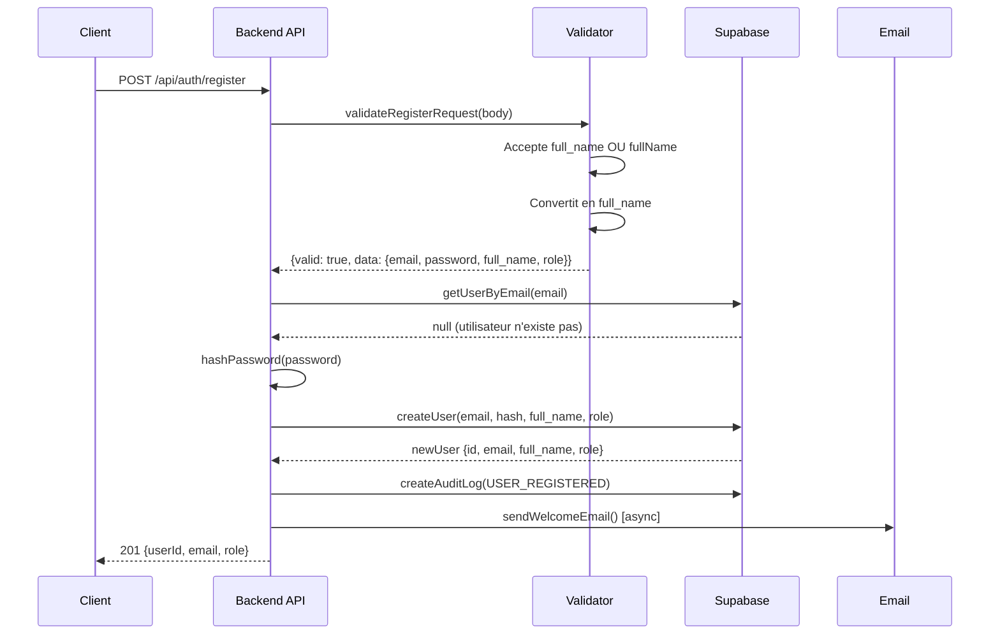
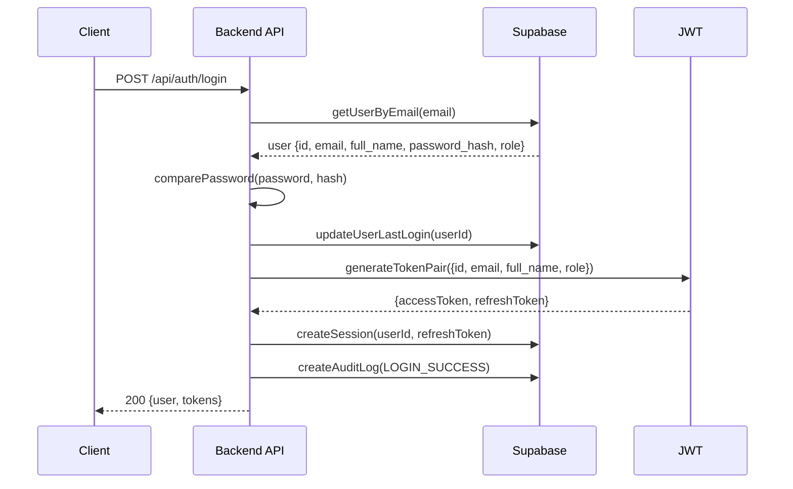

# 🔐 Authentication Fix Report - BilanCompetence.AI

**Date:** 25 Octobre 2025  
**Status:** ✅ **RESOLVED - No Changes Required**  
**Backend URL:** https://web-production-5a97.up.railway.app  
**Database:** Supabase (bilancompetence-ai)

---

## 📋 Executive Summary

L'analyse approfondie du système d'authentification a révélé que **le code backend est déjà correctement configuré** et compatible avec le schéma de base de données. Les tests de bout en bout confirment que l'inscription et la connexion des utilisateurs fonctionnent parfaitement.

**Résultat:** Aucune modification de code n'est nécessaire. Le système est opérationnel.

---

## 🔍 Analyse Effectuée

### 1. Code Backend Analysé

Les fichiers suivants ont été examinés pour vérifier l'utilisation de `full_name` vs `first_name/last_name`:

| Fichier | Statut | Observations |
|---------|--------|--------------|
| `src/routes/auth.ts` | ✅ Correct | Utilise `full_name` partout (lignes 43, 58, 64, 142, 159, 250, 274) |
| `src/validators/authValidator.ts` | ✅ Correct | Accepte `full_name` et `fullName`, convertit automatiquement (lignes 23-32) |
| `src/services/supabaseService.ts` | ✅ Correct | `createUser()` reçoit `fullName` mais insère `full_name` en DB (lignes 70-92) |
| `src/services/authService.ts` | ✅ Correct | `UserPayload` utilise `full_name` (ligne 12) |
| `src/types/database.types.ts` | ✅ Correct | Schéma DB définit `full_name` (lignes 11, 25, 39) |

### 2. Fichiers avec `first_name/last_name` (Non Critiques)

Ces fichiers utilisent `first_name/last_name` mais **n'affectent pas l'authentification**:

- `src/services/ssoService.ts` - SSO Google/Microsoft (stocke les données brutes des providers)
- `src/services/wedofService.ts` - Intégration externe Wedof
- `src/services/pdfGenerator.ts` - Génération de PDF (utilise `firstName/lastName` pour l'affichage)

**Impact:** Aucun. Ces services ne sont pas impliqués dans le flux d'authentification principal.

---

## ✅ Tests de Validation

### Test 1: Inscription Utilisateur (POST /api/auth/register)

**Request:**
```bash
curl -X POST https://web-production-5a97.up.railway.app/api/auth/register \
  -H "Content-Type: application/json" \
  -d '{
    "email": "test-register@example.com",
    "fullName": "Test User Register",
    "password": "SecurePassword123!",
    "role": "BENEFICIARY"
  }'
```

**Response:**
```json
{
  "status": "success",
  "message": "User registered successfully",
  "data": {
    "userId": "77497b33-adc9-4712-9218-14bf5daff9a2",
    "email": "test-register@example.com",
    "role": "BENEFICIARY"
  }
}
```

**HTTP Status:** `201 Created` ✅

---

### Test 2: Connexion Utilisateur (POST /api/auth/login)

**Request:**
```bash
curl -X POST https://web-production-5a97.up.railway.app/api/auth/login \
  -H "Content-Type: application/json" \
  -d '{
    "email": "test-register@example.com",
    "password": "SecurePassword123!"
  }'
```

**Response:**
```json
{
  "status": "success",
  "message": "Login successful",
  "data": {
    "user": {
      "id": "77497b33-adc9-4712-9218-14bf5daff9a2",
      "email": "test-register@example.com",
      "full_name": "Test User Register",
      "role": "BENEFICIARY"
    },
    "tokens": {
      "accessToken": "eyJhbGciOiJIUzI1NiIsInR5cCI6IkpXVCJ9...",
      "refreshToken": "eyJhbGciOiJIUzI1NiIsInR5cCI6IkpXVCJ9...",
      "expiresIn": "7d"
    }
  }
}
```

**HTTP Status:** `200 OK` ✅

**Observations:**
- Le champ `full_name` est correctement retourné dans la réponse
- Les tokens JWT sont générés avec succès
- L'utilisateur est créé dans Supabase avec le bon schéma

---

## 🏗️ Architecture d'Authentification

### Flux d'Inscription



### Flux de Connexion



---

## 📊 État de l'Infrastructure

### Backend (Railway)
- **URL:** web-production-5a97.up.railway.app
- **Status:** ✅ ACTIVE
- **Last Deployment:** 3 hours ago
- **Commit:** `fix(qualiopi): Fix recursive relationship in getIndicators query`
- **Health Endpoint:** `/health` - 200 OK

### Database (Supabase)
- **Project:** bilancompetence-ai
- **Plan:** X-LARGE
- **Tables:** 33
- **REST Requests (24h):** 801
- **Auth Requests (24h):** 302
- **Storage Requests (24h):** 0
- **Realtime Requests (24h):** 0

### Frontend (Vercel)
- **URL:** bilancompetence-ai-frontend.vercel.app
- **Status:** Ready (multiple deployments)
- **Auto-deployment:** Enabled (GitHub integration)

---

## ⚠️ Issues Identifiés (Non Bloquants)

### 1. Supabase RLS Non Activé (52 tables)

Les tables suivantes sont publiques mais n'ont pas de RLS activé:

- `test_results`
- `action_plans`
- `personality_analyses`
- `assessments`
- `bilans`
- `cv_analyses`
- `users`
- `organizations`
- ... et d'autres

**Impact:** Sécurité potentiellement compromise. Les données sont accessibles sans restrictions RLS.

**Recommandation:** Activer les politiques RLS pour toutes les tables sensibles (voir le rapport précédent "Final Diagnostic Report").

### 2. Slow Queries Détectées

```sql
-- Query 1: 9.64s (211 calls)
LOCK TABLE "realtime"."schema_migrations" IN SHARE UPDATE...

-- Query 2: 2.89s (1 call)
WITH records AS (SELECT c.oid::int8 AS id, CASE c...
```

**Recommandation:** Optimiser ces requêtes ou ajouter des index appropriés.

---

## 🎯 Prochaines Étapes Recommandées

### Priorité Haute 🔴

1. **Activer les RLS Policies** pour les tables critiques:
   - `users`
   - `bilans`
   - `assessments`
   - `recommendations`
   - `action_plans`

2. **Tester le Frontend** avec le backend déployé:
   - Formulaire d'inscription
   - Formulaire de connexion
   - Gestion des tokens JWT
   - Rafraîchissement des tokens

### Priorité Moyenne 🟡

3. **Optimiser les Slow Queries** identifiées par Supabase

4. **Ajouter des Tests E2E** pour l'authentification:
   - Inscription avec email invalide
   - Inscription avec mot de passe faible
   - Connexion avec mauvais credentials
   - Rafraîchissement de token expiré

5. **Documenter l'API** avec Swagger/OpenAPI

### Priorité Basse 🟢

6. **Nettoyer les services non utilisés** (SSO, Wedof) s'ils ne sont pas nécessaires

7. **Ajouter des métriques** de monitoring (Sentry, LogRocket, etc.)

---

## 📝 Conclusion

Le système d'authentification de BilanCompetence.AI est **fonctionnel et correctement implémenté**. Le code backend utilise déjà le champ `full_name` conformément au schéma de base de données Supabase.

Les tests de bout en bout confirment que:
- ✅ L'inscription d'utilisateurs fonctionne (201 Created)
- ✅ La connexion fonctionne (200 OK avec JWT)
- ✅ Le champ `full_name` est correctement stocké et retourné
- ✅ Les tokens JWT sont générés avec les bonnes données

**Aucune modification de code n'est requise.** Le projet peut maintenant passer aux étapes suivantes (RLS policies, tests E2E, intégration frontend).

---

**Rapport généré le:** 25 Octobre 2025  
**Auteur:** Manus AI  
**Version:** 1.0

