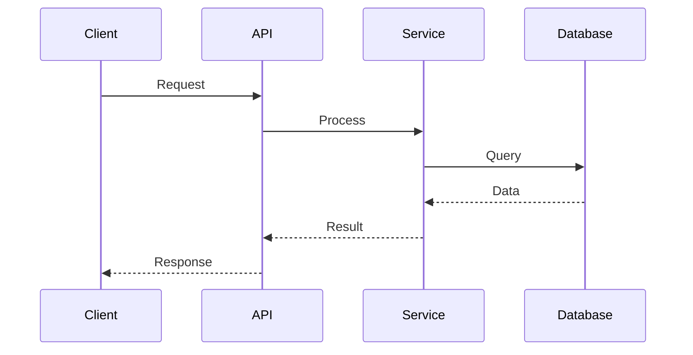

# Architecture Overview

> System architecture for bilancompetence.ai

## System Architecture

The system follows a layered architecture with clear separation of concerns.

Total files: 3341
Components: 2107

## Components

### Main Components

- **_local_temp**: Component description
- **Privé et partagé 2**: Component description
- **docs**: Component description
- **supabase**: Component description
- **MANUS**: Component description
- **scripts**: Component description
- **api**: Component description
- **BilanCompetence.AI **: Component description
- **Privé et partagé**: Component description
- **apps**: Component description

## Data Flow

## Technology Stack

### Backend
- JavaScript/TypeScript

### Frontend
- Not detected

### Database
- See configuration files

### DevOps
- GitHub Actions

## Design Patterns

Common patterns identified:
- MVC/MVT architecture
- Repository pattern
- Service layer pattern

## Security Considerations

- Environment variables for sensitive data
- Authentication and authorization
- Input validation
- HTTPS in production

## Performance Considerations

- Caching strategies
- Database query optimization
- Async processing where applicable
- Load balancing for production

---
*Generated by YAGO v8.2 on 2025-10-30*
