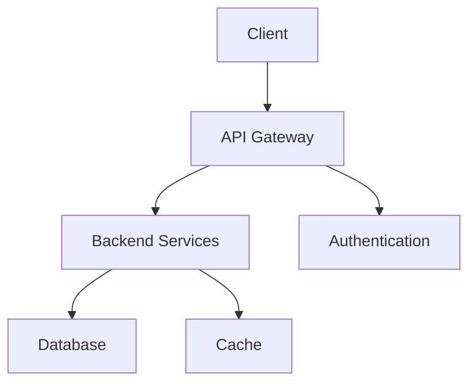
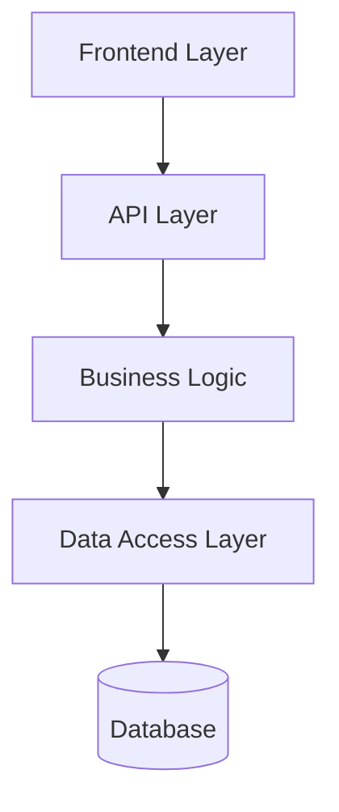
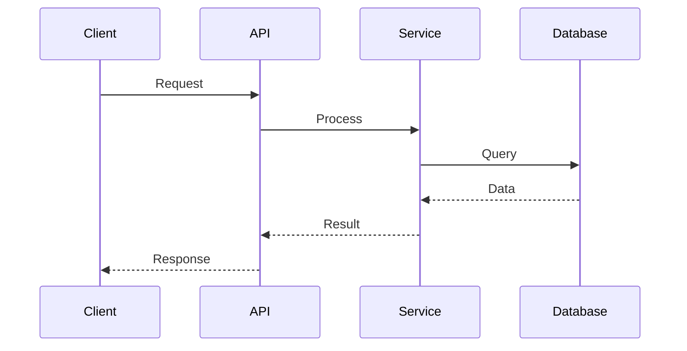
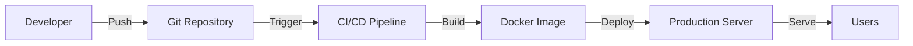

# Architecture Diagrams

> Visual representations of bilancompetence.ai architecture

## System Overview

## Component Diagram

## Data Flow

## Deployment Architecture

---
*Generated by YAGO v8.2*
